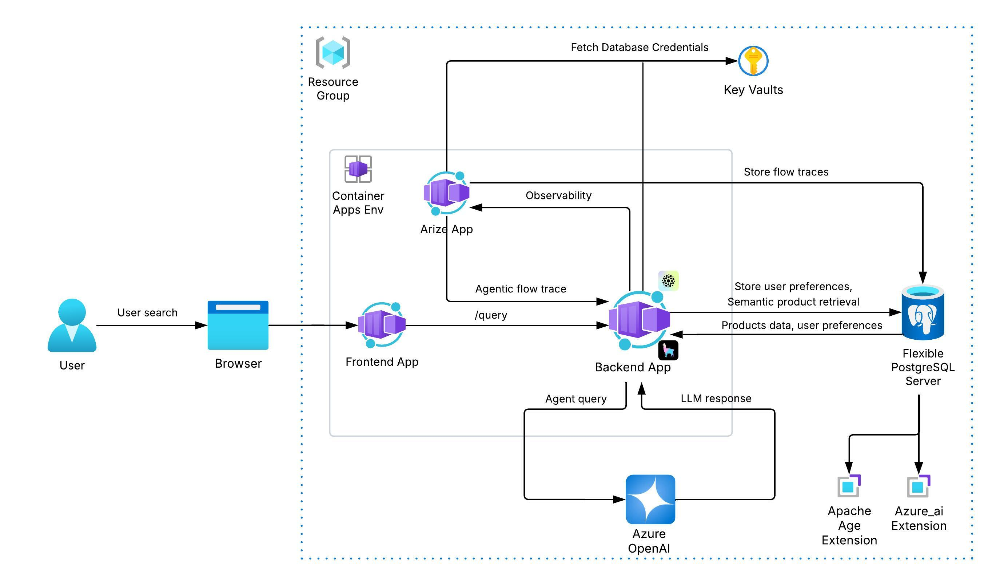

# 1.2 App Architecture

The application architecture for **AgenticShop** is designed to showcase how modern AI-powered applications can be modular, observable, and scalable. This section highlights the core components of the application and how they interact with each other using a combination of frontend/backend technologies and Azure cloud services.

At the heart of the system is a **multi-agent workflow engine** built on top of LlamaIndex. It integrates seamlessly with AI models, vector stores, and memory systems to deliver personalized product experiences based on user interactions.

## Technologies and Azure Services Used

This solution leverages a decoupled architecture built on the following components:

### Frontend

- **React (SPA)**: A responsive and dynamic single-page application running in the browser.
- Hosted as an Azure Container App.

### Backend

- **FastAPI**: High-performance Python web framework handling API logic.
- **Azure Container Apps**: Hosts both frontend and backend components.
- **Azure Key Vault**: Securely stores and retrieves database credentials and secrets.
- **Azure OpenAI**: Provides GPT-4o for agent reasoning and personalization.
- **Apache AGE (PostgreSQL Extension)**: Enables graph queries using Cypher syntax.
- **Azure AI (PostgreSQL Extension)**: Used for in-database embedding generation and summarization.

### Observability

- **Phoenix by Arize**: Observability tool that captures and visualizes LLM traces and workflows. Integrated directly into the backend app.

### Data Store

- **Azure Database for PostgreSQL Flexible Server**:
  - Stores products, features, reviews, and user memories.
  - Hosts `mem0_chatstore` table for memory.
  - Powers AI embeddings, sentiment insights, and graph creation.

## App Architecture Diagram

The following diagram illustrates how these services work together to deliver a seamless AI-powered experience:

Users interact with the system via a web browser. Their queries are routed through the backend where multi-agent workflows are invoked. Data and memory are retrieved from PostgreSQL, augmented with OpenAI reasoning, and the results are streamed back to the frontend. All workflow activity is traceable via Phoenix for debugging and evaluation.

This architecture demonstrates how you can combine modern AI tools and cloud-native services to build rich, interactive, and intelligent applications.
