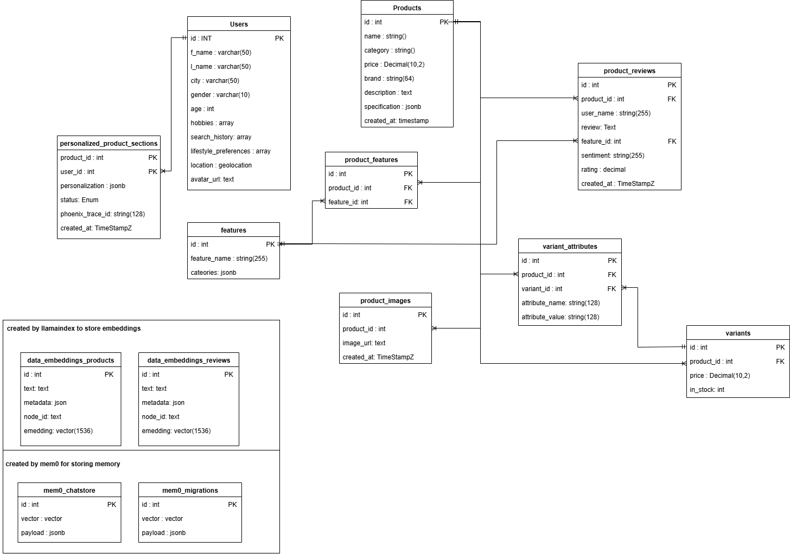

# 1.4 Backend Data Structures

This section provides an overview of the core database schema and data artifacts used in the AgenticShop backend. It highlights **key tables and fields** that enable AI-powered personalization, semantic search, review analysis, and conversational AI. It also explains how these components are leveraged by backend services and Azure AI integrations.

## Understanding the Table Schema

AgenticShop processes **user profiles, product catalogs, product variants, customer reviews, product features, personalized content, and chat interactions** using a structured PostgreSQL schema. Below is an overview of the **key tables** and their roles:

### Core Tables & Their Purpose

| **Table**                        | **Description** |
|-----------------------------------|----------------------------------------------------------------------------------------------------|
| `users`                          | Stores user profiles, including preferences (hobbies, lifestyle), demographics, and search history. Used for personalization. |
| `products`                       | Contains core product catalog information, specifications (JSONB), pricing, and descriptions.      |
| `product_images`                 | Stores URLs for product images, linked to the `products` table.                                    |
| `features`                       | Defines distinct product features (e.g., "Water Resistance", "Battery Life") and their applicable categories (JSONB). |
| `product_features`               | A junction table linking products to their respective features (many-to-many relationship).        |
| `variants`                       | Represents specific variations of a product (e.g., based on color, size), including price and stock levels. |
| `variant_attributes`             | Stores key-value attributes for each product variant (e.g., `attribute_name`: "Color", `attribute_value`: "Blue"). |
| `product_reviews`                | Stores customer reviews, ratings, associated product, user, and AI-extracted sentiment and feature ID. |
| `personalized_product_sections`  | Stores AI-generated personalized content (JSONB) for specific user-product combinations, including status and tracing IDs for AI workflows. |
| `embeddings_products`            | Vector store holding embeddings for product data (e.g., name, description, category) to enable semantic search for products. |
| `embeddings_reviews`             | Vector store holding embeddings for product review text to enable semantic search and analysis of reviews. |

### How These Tables Work Together

1.  **User data** (`users`) provides context for personalization.
2.  **Product information** (`products`, `product_images`, `features`, `product_features`, `variants`, `variant_attributes`) forms the catalog that AI agents interact with.
3.  **Customer reviews** (`product_reviews`) are processed by AI to extract sentiment and identify key features discussed.
4.  **Embeddings** (`embeddings_products`, `embeddings_reviews`) are generated from product and review text, enabling semantic search and retrieval.
5.  AI agents generate **personalized content** (`personalized_product_sections`) based on user profiles, product data, reviews, and inventory status.
7.  **Apache AGE graph data** (derived from these tables) models relationships between products, reviews, and features for advanced analytics and explainable AI.




---

## Key Fields Used in AI Processing

AgenticShop integrates with Azure AI services, vector databases, and graph databases to extract, validate, personalize, and process information. Below are **key fields** that play a crucial role in these AI workflows:

### Relational, Vector & AI Fields

| **Field Name**                  | **Table(s)**                                     | **AI Usage** |
|---------------------------------|--------------------------------------------------|-------------------------------------------------------------------------------------------------------------------|
| `embedding`                     | `embeddings_products`, `embeddings_reviews`      | Stores vector embeddings for semantic search, similarity retrieval, and RAG for products and reviews.             |
| `personalization`               | `personalized_product_sections`                  | JSONB field storing structured AI-generated content (features, descriptions) tailored to the user and product.    |
| `specifications`                | `products`                                       | JSONB field for flexible product attributes; can be used by AI to match user needs or extract detailed info.    |
| `review` (text)                 | `product_reviews`                                | Raw text of customer reviews, processed by NLP models for sentiment analysis and feature extraction.              |
| `sentiment`                     | `product_reviews`                                | AI-extracted sentiment (positive, negative, neutral) from review text.                                            |
| `feature_id`                    | `product_reviews`, `product_features`            | Links reviews and products to specific features, enabling targeted analysis and feature-based recommendations.  |
| `attribute_name`, `attribute_value` | `variant_attributes`                           | Used by AI (e.g., Inventory Agent) to find product variants matching user preferences (e.g., color, size).      |
| `hobbies`, `lifestyle_preferences`, `search_history`, `age`, `gender`, `location` | `users`                                          | User profile attributes used by AI agents to understand user context and personalize recommendations/content.     |
| `status`                        | `personalized_product_sections`                  | Tracks the state of AI content generation workflows (pending, running, done, failed).                             |
| `phoenix_trace_id`              | `personalized_product_sections`                  | Links to observability platforms (like Arize Phoenix) for tracing and debugging AI agent execution.             |

### Apache AGE Graph Relationships (`product_review_graph`)

| **Node/Edge Type**      | **Description in Graph**                                     | **AI Usage** |
|-------------------------|--------------------------------------------------------------|---------------------------------------------------------------------------------------------------|
| `Product` (Node)        | Represents a product with properties like `id`, `name`, `category`. | Central entity for linking reviews and features; used in graph traversals for recommendations.      |
| `Review` (Node)         | Represents a customer review with `id`, `product_id`, `feature_id`, `sentiment`, `text`. | Source of sentiment and feature linkage; used to find influential reviews or feature-specific feedback. |
| `Feature` (Node)        | Represents a specific product feature with `id`, `name`, `categories`.  | Target for review sentiment; helps identify highly-rated or problematic features.                   |
| `HAS_FEATURE` (Edge)    | Connects `Product` nodes to `Feature` nodes.                 | Establishes which features a product possesses.                                                     |
| `HAS_REVIEW` (Edge)     | Connects `Product` nodes to `Review` nodes.                  | Links products to all their associated reviews.                                                     |
| `positive_sentiment` (Edge) | Connects `Review` to `Feature` (props: `sentiment`, `product_id`, `feature_id`). | Highlights positive feedback on specific features, useful for AI-driven summarization or recommendations. |
| `negative_sentiment` (Edge) | Connects `Review` to `Feature` (props: `sentiment`, `product_id`, `feature_id`). | Highlights negative feedback on specific features, identifying areas for improvement or caution.      |
| `neutral_sentiment` (Edge)  | Connects `Review` to `Feature` (props: `sentiment`, `product_id`, `feature_id`). | Captures neutral mentions of features.                                                              |

### Why These Fields and Structures Matter

- **Vector embeddings (`embedding`)** in `embeddings_products` and `embeddings_reviews` enable **semantic search**, allowing AI to find relevant products or reviews based on meaning rather than just keywords.
- **Personalized content (`personalization` in `personalized_product_sections`)** stores the direct output of AI agents, delivering tailored experiences to users.
- **JSONB fields (`specifications`, `personalization`)** provide flexibility for AI agents to work with evolving data structures and store rich, nested information.
- **Graph relationships in `product_review_graph`** support **GraphRAG (Retrieval-Augmented Generation)** and complex queries, allowing AI to understand interconnectedness (e.g., "show me products with highly-rated 'battery life' reviews").
- **Observability fields (`phoenix_trace_id`)** are crucial for monitoring and debugging complex multi-agent AI systems.

---

## Apache AGE Graph Structure (`product_review_graph`)

The `product_review_graph` is created using Apache AGE to model relationships between products, their features, and customer reviews. This graph enables complex queries and insights that are valuable for AI-driven analysis and recommendations.

### Nodes (Vertices)

1.  **Product**: Represents a product.
    *   Properties: `id` (integer), `name` (string), `category` (string)
    *   Example: `(p:Product {id: 101, name: 'SmartWatch X200', category: 'Electronics'})`

2.  **Review**: Represents a customer review.
    *   Properties: `id` (integer), `product_id` (integer), `feature_id` (integer, nullable), `sentiment` (string), `text` (string)
    *   Example: `(r:Review {id: 5001, product_id: 101, feature_id: 10, sentiment: 'positive', text: 'Great battery life!'})`

3.  **Feature**: Represents a specific product feature.
    *   Properties: `id` (integer), `name` (string), `categories` (jsonb array of strings)
    *   Example: `(f:Feature {id: 10, name: 'Battery Life', categories: ['Electronics', 'Wearables']})`

### Relationships (Edges)

1.  **Product `-[HAS_FEATURE]->` Feature**: Indicates that a product has a particular feature.
    *   Direction: Product to Feature
    *   Example: `(p:Product)-[:HAS_FEATURE]->(f:Feature)`

2.  **Product `-[HAS_REVIEW]->` Review**: Links a product to one of its reviews.
    *   Direction: Product to Review
    *   Example: `(p:Product)-[:HAS_REVIEW]->(r:Review)`

3.  **Review `-[positive_sentiment]->` Feature**: Links a review to a feature when the review expresses positive sentiment about that feature.
    *   Direction: Review to Feature
    *   Properties on edge: `sentiment` (string, e.g., "positive"), `product_id` (integer), `feature_id` (integer)
    *   Example: `(r:Review)-[:positive_sentiment {sentiment: 'positive', product_id: 101, feature_id: 10}]->(f:Feature)`

4.  **Review `-[negative_sentiment]->` Feature**: Links a review to a feature when the review expresses negative sentiment about that feature.
    *   Direction: Review to Feature
    *   Properties on edge: `sentiment` (string, e.g., "negative"), `product_id` (integer), `feature_id` (integer)
    *   Example: `(r:Review)-[:negative_sentiment {sentiment: 'negative', product_id: 102, feature_id: 12}]->(f:Feature)`

5.  **Review `-[neutral_sentiment]->` Feature**: Links a review to a feature when the review expresses neutral sentiment or a factual mention of that feature.
    *   Direction: Review to Feature
    *   Properties on edge: `sentiment` (string, e.g., "neutral"), `product_id` (integer), `feature_id` (integer)
    *   Example: `(r:Review)-[:neutral_sentiment {sentiment: 'neutral', product_id: 103, feature_id: 15}]->(f:Feature)`

This graph structure allows AI agents to perform queries like:
*   "Find all positive reviews related to the 'Camera Quality' feature for 'Smartphone Model Z'."
*   "Which features are most frequently mentioned negatively for products in the 'Laptops' category?"
*   "Show products similar to Product X that have good reviews on 'Durability'."

---

## Text-Based Graph Diagram

The following diagram illustrates the relationships between the primary nodes in the `product_review_graph`:

```text
+-----------+     HAS_FEATURE     +-----------+
|  Product  |-------------------->|  Feature  |
+-----------+                     +-----------+
      |                                 ^
      |                                 |
      | HAS_REVIEW                      | positive_sentiment
      |                                 | negative_sentiment
      v                                 | neutral_sentiment
+-----------+                           |
|  Review   |---------------------------+
+-----------+
```

**Explanation of Diagram:**

*   **Nodes:**
    *   `[Product]`: Represents a product.
    *   `[Feature]`: Represents a product feature.
    *   `[Review]`: Represents a customer review.
*   **Edges (Relationships):**
    *   `Product --HAS_FEATURE--> Feature`: A product has one or more features.
    *   `Product --HAS_REVIEW--> Review`: A product has one or more reviews.
    *   `Review --positive_sentiment--> Feature`: A review expresses positive sentiment towards a specific feature. (Edge has properties)
    *   `Review --negative_sentiment--> Feature`: A review expresses negative sentiment towards a specific feature. (Edge has properties)
    *   `Review --neutral_sentiment--> Feature`: A review expresses neutral sentiment or mentions a specific feature. (Edge has properties)

This diagram provides a simplified visual representation of how products, features, and reviews are interconnected within the graph database, enabling complex queries for AI-driven insights.
