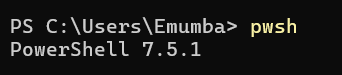

# 2.2 Development Environment Setup

To simplify setup and ensure consistency, this solution accelerator uses a **Dev Container** as the exclusive development environment.

Dev Containers provide a clean, pre-configured workspace with all necessary tools and dependencies already installed. Whether you're on Windows, macOS, or Linux, using Dev Containers helps you avoid common setup issues and ensures that everyone in the workshop is working in the same environment.

## Why Dev Containers?

Using Dev Containers offers several benefits:

- ✅ **Consistent Development Environment**: Avoid the “it works on my machine” problem by running the same stack across all participants and contributors.
- ⚡ **Quick Setup**: All required dependencies (Python, PostgreSQL tools, CLI utilities, etc.) are pre-installed and version-controlled.
- 🔄 **Isolated Workspace**: Changes you make inside the container don’t affect your global system setup.
- 🔧 **Reproducibility**: Easily reproduce the environment in CI/CD pipelines or across teams.
- 🧪 **Great for Experimentation**: Break things without consequences — just rebuild the container!

Want to understand more about what Dev Containers are and how they work? Check out this short [YouTube video by Visual Studio Code](https://www.youtube.com/watch?v=b1RavPr_878&ab_channel=VisualStudioCode) (7 mins).

📘 For deeper documentation, visit the [official Dev Container guide](https://code.visualstudio.com/docs/devcontainers/containers).

## Install Prerequisites

To run the Dev Container successfully, you’ll need to install a few tools on your local machine. Once installed, you’ll be able to open the project in VS Code and let it configure everything automatically inside the container.

> 🛠️ **Minimum Setup**  
> You only need to install the following system-level tools — the rest will be handled by the Dev Container itself:

### Install Software

The required development environment uses a Visual Studio (VS) Code editor with a Python runtime. To complete this lab on your own computer, you must install the following required software. On completing this step, you should have installed:

- [X] Windows Powershell 7.5+ (Only if using Windows)
- [X] WSL 2 and Ubuntu (Only if using Windows)
- [X] Git
- [X] Docker desktop
- [X] Visual Studio Code

### Install Windows Powershell 7.5+ (Only if using Windows)

1. Download MSI package for [Windows Powershell](https://learn.microsoft.com/en-us/powershell/scripting/install/installing-powershell-on-windows?view=powershell-7.5)

2. Run the package to install Windows Powershell.

3. Once installed, open a command prompt on your machine and verify the installation by running the following:

    ```bash title=""
    pwsh
    ```
    
4. The command prompt should show the version of PowerShell as `7.5.0` or greater.
    

!!! failure "Error running `pwsh` command"

    If there's an error running the `pwsh` command, then PowerShell 7 is not installed.

    

### Install WSL 2 and Ubuntu (Only if using Windows)

Windows Subsystem for Linux (WSL) is a powerful tool that allows the ability to run Linux based Docker images on the Windows operating system.  Plus, WSL 2 provides advantages to using
Docker Desktop on Windows, such as better memory management for large containers.  WSL 2 is needed because the dev container for this solution accelerator is built on an Ubuntu Linux base image.

1. First we need to install Ubuntu from the Microsoft App Store:

    - Open "Microsoft Store" from your Start Menu
    - Search for "Ubuntu"
    - For the search result titled simply "Ubuntu", select and click "Get" to install
    - Reboot if it asks.

2. Open PowerShell as Admin and run:

    ```powershell title=""
    wsl --install
    ```

3. It will install WSL 2.
4. Reboot if it asks.
5. Test the installation:

    - Opening Terminal in PowerShell shell, and type `wsl'
    - This should load an Ubuntu Linux Shell command line and if you type `ps` you will see a list of processes, this means everything works correctly

### Install Git

Git enables you to manage your code by tracking changes, maintaining a version history, and facilitating collaboration with others. This helps in organizing and maintaining the integrity of your project's development.

1. Download Git from <https://git-scm.com/downloads>.

2. Run the installer using the default options.

### Install Docker Desktop

Docker Desktop is an application that allows you to build, share, and run containerized applications on your local machine. It provides a user-friendly interface to manage Docker containers, images, and networks. By streamlining the containerization process, Docker Desktop helps you develop, test, and deploy applications consistently across different environments.

1. Download and install Docker Desktop for your OS:

    - [Linux](https://docs.docker.com/desktop/setup/install/linux/)
    - [Mac](https://docs.docker.com/desktop/setup/install/mac-install/)
    - [Windows](https://docs.docker.com/desktop/setup/install/windows-install/)

2. Configure Docker Desktop to use WSL 2 based engine (For Windows Only)

    - Open Docker Desktop
    - Click Settings
    - Click General
    - Select `Use the WSL 2 based engine`
    - Click `Apply & restart`

3. Configure Docker Desktop to use WSL 2 integration (For Windows Only)

    - Open Docker Desktop
    - Click Resources
    - Click WSL integration
    - Select `Enable integration with my default WSL distro`
    - Select `Ubuntu`
    - Click `Apply & restart`

### Install Visual Studio Code

Visual Studio Code is a versatile, open-source code editor that combines powerful features with an intuitive interface to help you efficiently write, debug, and customize projects. Note that
the needed extensions will automatically be installed within the `dev container`, so no need to install any additional extensions now.

1. Download and install from <https://code.visualstudio.com/download>.

    - Use the default options in the installer.    

2. After installation is completed, launch Visual Studio Code.

3. In the **Extensions** menu, search for and install the following extensions from Microsoft:

    - [Dev Containers](https://marketplace.visualstudio.com/items?itemName=ms-vscode-remote.remote-containers)

4. Close VS Code.

## ✅ You're Ready to Launch!

Once you’ve installed everything above, you can move to the next step where you’ll clone the repo and then open the cloned repo in VS Code, and it will **automatically prompt you to reopen in a Dev Container**.

From there, VS Code will take care of building the container and installing all required tools inside it.

Let’s get started!