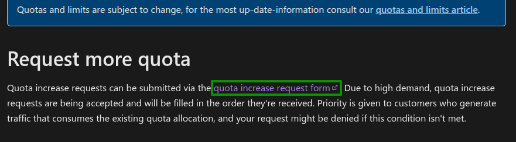
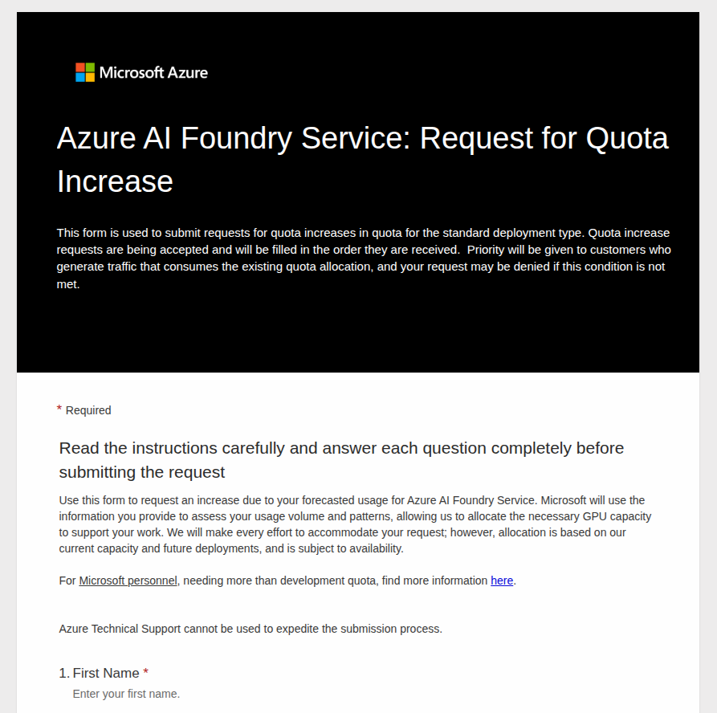
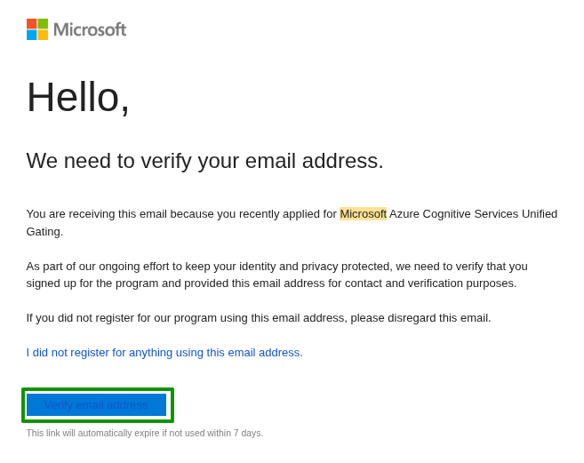

# 2.4 Verify Azure Quota

This solution requires an appropriate region where Azure OpenAI models are supported and those regions should contain required quota for `GPT-4o` and `text-embedding-ada-002` models. In this section, you should have:

- [X] Verified your Azure OpenAI Models quota

## Request Azure OpenAI Models Quota¶

In this task, you must request Azure OpenAI models quota in the region that you have selected.

1. To request Azure OpenAI models quota, you must [submit a form](https://learn.microsoft.com/en-us/azure/ai-services/openai/how-to/quota?tabs=rest#request-more-quota)

    

2. You shall see a form. Input the necessary information about quota you are requesting. The quota required for Agentic Shop is following:

    !!! info "Quota required for postgres agentic shop" 

        - 150K TPMs of `GlobalStandard` capacity for `gpt-4o` model.
        - 120K TPMs of `Standard` capacity for `text-embedding-ada-002` model.

    

3. Once submitted, you shall receive a confimation mail on the email that you have added in the form to vet the quota request. Confirm the quota request.

    

4. Once the quota is approved, you shall receive another email stating that your quota has been approved. This may take some time depending on the requests Azure support team receives. 

    !!! failure "Not enough Azure OpenAI models quota"

        If you did not approve your Azure OpenAI models quota prior to sdeployment, you may receive a quota error message similar to the following:

        _(InsufficientQuota) This operation require 150 new capacity in quota Tokens Per Minute (thousands) - gpt-4o GlobalStandard, which is bigger than the current available capacity._
        
	    _(InsufficientQuota) This operation require 120 new capacity in quota Tokens Per Minute (thousands) - text-embedding-ada-002 Standard, which is bigger than the current available capacity._