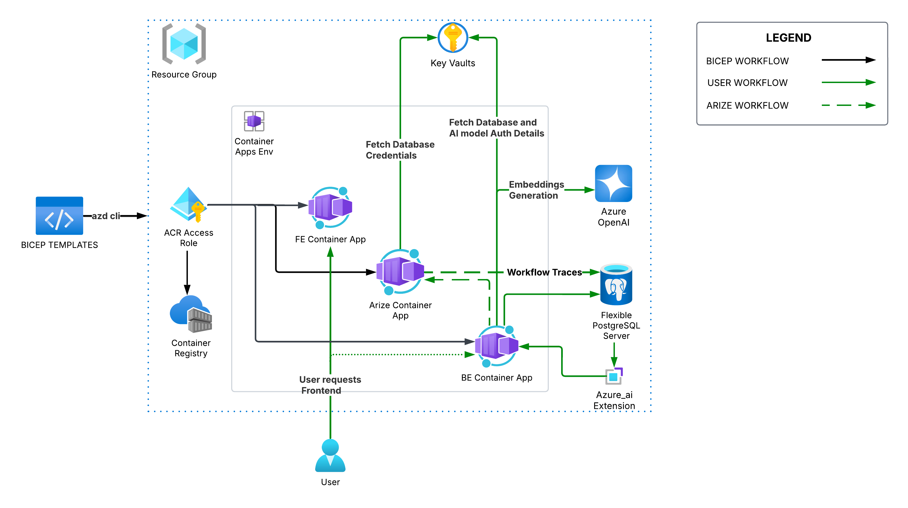
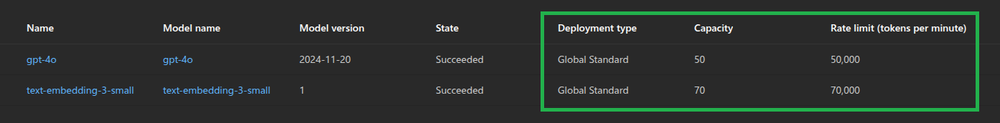
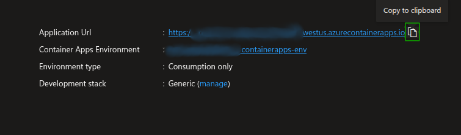
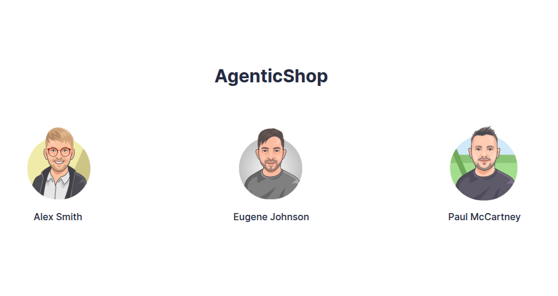

# 2.6 Validate Deployment

!!! success "SETUP IS COMPLETE!"

    You just completed the **PROVISION** and **SETUP** steps of guide. 

    - [X] You installed the required tools and software
    - [X] You cloned the sample repo and created a local clone
    - [X] You provisioned infrastructure resources on Azure
    - [X] You configured your local development environment

Here's a reminder of the Azure Application Architecture you can reference as you check your provisioned Resource Group to ensure these resources were created.

In this section, you will validate your setup before moving on to the next phase of solution development.

---

## Inspect deployed Azure resources

!!! tip "The Azure Portal allows you to view the resources provisioned on Azure and verify that they are setup correctly"

1. Open the [Azure portal Resource Group page](https://portal.azure.com/#browse/resourcegroups) in a new browser tab. You may be prompted to login.

2. You may be presented with a "Welcome to Microsoft Azure" screen. Select **Cancel** (to dismiss it) or click **Get Started** (to take an introductory tour of the Azure Portal).

3. You should be taken directly to the Resource Groups page for your subscription. In the list of resource groups, locate the one named `rg-dev` (or, if you assigned a different name, find that one). This resource group was created for you as part of the `azd up` resource deployment. It contains all of the Azure resources required to build and deploy your AI-powered solution.

    !!! tip "You can use the search filter to reduce the number of resource groups displayed."

4. Select your resource group.

    !!! note "Review the list of deployed resources."

        In addition to creating a resource group, the `azd up` command deployed multiple resources into that resource group, as shown in the table below.

        | Resource type | Name |
        | :-- | :-- |
        | Container Registry | `dev<unique_string>` |
        | Key Vault* | `dev-<unique_string>` |
        | Container Apps Environment | `dev-<unique_string>` |
        | Azure Database for PostgreSQL - Flexible Server | `dev<unique_string>` |
        | Azure OpenAI | `dev-<unique_string>` |
        | Container App | `rt-frontend` |
        | Container App | `rt-backend` |
        | Container App | `arize` |

        The `<unique_string>` token in the above resource names represents the unique string that is generated by the Bicep scripts when naming your resources. This ensures resources are uniquely named and avoid resource naming collisions.

## Ensure the Azure Flexible Server for PostgreSQL is deployed

The `azd up` command included steps to deploy the **Azure Flexible Server for PostgreSQL**. This server will store all the data and information related to the solution as well as use multiple postgres extensions used by the backend app to provide the multi-agent workflow functionalities.

!!! info "Azure Flexible Server deployment"

    Azure Database for PostgreSQL Flexible Server is a fully managed database service designed to provide more granular control and flexibility over database management functions and configuration settings. The service generally provides more flexibility and server configuration customizations based on user requirements.

## View Azure OpenAI model deployments in Azure AI Foundry

!!! tip "The Azure AI Foundry portal lets you view and manage the Azure AI resources for your app."

You will use the Azure AI Foundry portal to verify the `gpt-4o` and `text-embedding-3-small` models were deployed into your Azure OpenAI service.

1. In the Azure portal, return to the resource group containing your resources and select the **Azure OpenAI** resource.

2. On the Azure OpenAI resource's **Overview** page, select **Explore Azure AI Foundry portal**.

3. In **Azure AI Foundry**, select the **Deployments** menu item under **Shared resources** in the left-hand navigation menu.

4. Verify you see a `gpt-4o` deployment for the `gpt-4o` model and a `text-embedding-3-small` deployment for the `text-embedding-3-small` model.

5. Ensure that the models that you have deployed have the required quota and deployment type.

    

!!! tip "Leave the Azure Portal open. You will revisit it later."

## Test the Deployed App

1. In the Azure portal, return to the resource group containing your resources and select the **Container app** resource.

2. In the **Essentials** section of the Portal Container App's **Overview** page, select the **Application Url** to open the deployed AgenticShop app in a new browser tab.

    

3. In the _AgenticShop_ landing page, select any **User** and you can see the home page where all the products are listed!

    

4. You can select any product and the UI will show you the details and personalized recommendations of the products powered by AI models.
