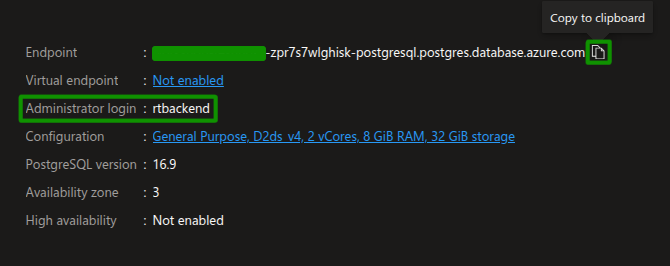

# 2.7 Setup Local Dev Environment

In this step, you will configure your Python development environment in Visual Studio Code. At the end of this step, you should have:

- [x] Installed Required Libraries
- [X] Create and Populated `.env` Files for the Apps.
- [X] Ran the Apps Locally.

## Dev Containers (Recommended)

## Local Dev Environment

### Install Required Libraries

The `pyproject.toml` file in the `backend` folder contains the set of Python libraries needed to run the Python components of the solution accelerator.

!!! tip "Review required libraries"

    Open the `backend/pyproject.toml` file in the repo to review the required libraries and the versions that are being used.

1. From the integrated terminal window in VS Code, run the following commands to install the required libraries in your virtual environment:

    ```bash title=""
    cd backend
    poetry install
    ```

2. From the integrated terminal window in VS Code, change directory into the frontend directory and run the following commands to install the required libraries in your virtual environment:

    ```bash title=""
    cd ../frontend
    npm install
    ```

### Create `.env` File for Apps

1. For each of the following directories, navigate in each directory to create a `.env` file and populate it with the required environment variables:

    ```bash title=""
    `frontend/.env`
    `backend/.env`
    `arize-phoenix/.env`
    ```

    Let's populate those files with environment variables. Refer to the project documentation or any provided `.env.example` files for the required variables in each app directory.

2. Inside the `.env` file of `frontend` directory , paste the following variable:

    ```bash title=""
    VITE_BE_APP_ENDPOINT=http://127.0.0.1:8000
    ```

3. Inside the `.env`. file of `arize-phoenix` directory, paste the following variable:

    ```bash title=""
    PHOENIX_SQL_DATABASE_URL=postgresql://${administratorLoginUser}:${administratorLoginPassword}@${postgresServer.outputs.POSTGRES_DOMAIN_NAME}:5432/arize_db
    ```
    
    - The values of variables `administratorLoginUser` and `administratorLoginPassword` are set in the `main.parameters.json` file in the `infra` directory. Copy those values and replace them in the `.env` file you created above. 

    - To get the endpoint of the database, go to the Azure Flexible Server for PostgreSQL inside the Resource Group you created with `azd` and copy the database endpoint as shown below. You can also get the administrator login username for PostgreSQL as well. 
        

    !!! warning "Change the default credentails"

        The credentials used here are default and only serve for learning purposes. Change these PostgreSQl credentials as best security practice before deploying the AgenticShop solution.

### Run Apps in Local Environment

1. Setup **Arize AI** docker container:

    - In the integrated terminal window in VS Code, navigate to the `arize-phoenix` directory and run the docker build command to build the container.

    ```bash title=""
    cd ../arize-ai
    docker build -t arize-ai .
    ```

    - When the container is built, execute the following command to run the docker container in the integrated terminal window in VS Code.

    ```bash title=""
    docker run --name arize-ai-container -p 6006:6006 arize-ai
    ```

2. Use the following commands to run the apps in the local environment you have setup in previous steps:

    - To run **backend** app, run the following in the integrated terminal window in VS Code

      Change directory in the `backend` directory, activate the poetry environment:
      
      ```bash title=""
      uvicorn src.main:app --host 0.0.0.0 --port 8000 --log-config logging_config.yaml --reload
      ```

    - To run **frontend** app, run the following in the integrated terminal window in VS Code

      Change directory in the `frontend` directory, start the frontend development server:
      
      ```bash title=""
      npm run dev
      ```
    
