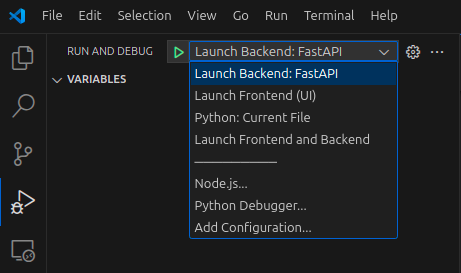
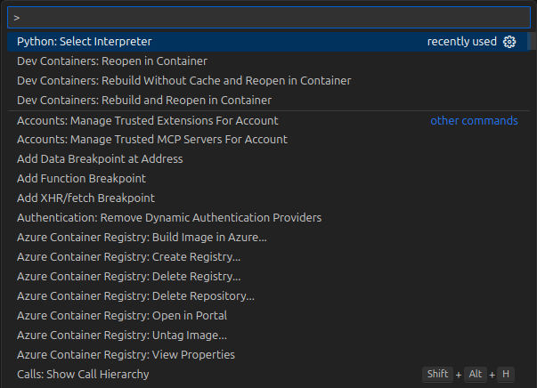
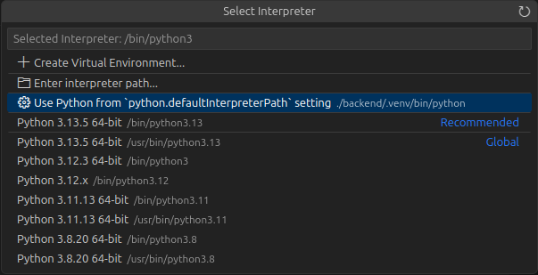

# 2.9 Run Application

## Run Database Migrations

Before starting the backend or frontend applications, you **must run the database migrations** to set up the required tables and schema. This is essential after configuring your environment variables, especially for a new deployment, as the database will be empty and the app will not function correctly without the necessary tables.

To apply the migrations, run the following command from the `backend` directory:

```bash
cd backend
alembic upgrade head
```

This command applies all pending migrations and ensures your database schema is up to date.
> **More Information:** For detailed guidance on Alembic migrations, see [Section 3.2: Alembic Migrations](../03-Setting-Up-Data-in-PostgreSQL/02-Alembic-Migrations.md) of this workshop.

> **Note:** This step is required regardless of whether you use the command line or the VS Code debugger to run the applications.

## Run Apps in Local Environment

There are **two options** for running the backend and frontend applications in your local environment:

1. **Using Command Line:**
    - Start each app manually in separate terminal windows using the provided commands.
2. **Using VS Code Debugger (Recommended):**
    - Use the built-in debugger to launch the backend, frontend, or both apps simultaneously with pre-configured launch settings.

Choose the option that best fits your workflow and follow the corresponding instructions below.

---

We use Arize Phoenix to monitor and gain observability into the workflows and agents, helping you track and debug application behavior effectively.
 
> **Important:** Starting the **Arize Phoenix** container is required before running backend apps locally. (In devcontainers, this starts automatically—see below.)


### 1. Start Arize Phoenix Docker Container

The `Dockerfile` for Arize Phoenix used in this project is very simple. It is based directly on the official Arize Phoenix base image and exposes the required ports for the service:

This means the container runs the standard Arize Phoenix service with no custom modifications, making setup straightforward and reliable.

Open a terminal in VS Code and run:

```bash
cd ../arize-phoenix

docker build -t arize-phoenix .

docker run --name arize-phoenix-container -p 6006:6006 -v phoenix_data:/root/.phoenix/ arize-phoenix
```

---

### Option 1: Run Apps Using Command Line

- **Backend:**
  Open a new integrated terminal in VS Code by selecting **Terminal > New Terminal** from the menu or using the shortcut ``Ctrl+` ``. This ensures your backend runs in its own terminal window.

  ```bash
  cd backend
  uvicorn src.main:app --host 0.0.0.0 --port 8000 --log-config logging_config.yaml --reload
  ```
  > This command starts the FastAPI backend server using Uvicorn with live reload enabled.

- **Frontend:**
  Open a new integrated terminal in VS Code by selecting **Terminal > New Terminal** from the menu or using the shortcut ``Ctrl+` ``. This ensures your frontend runs in its own terminal window.

  ```bash
  cd frontend
  npm run dev
  ```
  > This command starts the frontend development server using Vite and serves the React app.


You can run these commands in separate terminals to start both apps simultaneously.

---

### Option 2: Run Apps Using VS Code Debugger **Recommended**

You can use the VS Code debugger to start the backend, frontend, or both at once:

1. Open the Run & Debug panel in VS Code (`Ctrl+Shift+D`).
2. Select one of the following configurations from the dropdown:
    - **Launch Backend: FastAPI** – starts the backend (also starts Arize container automatically via preLaunchTask).
    - **Launch Frontend (UI)** – starts the frontend app.
    - **Launch Frontend and Backend** – starts both apps simultaneously.
3. Click the green play button to start debugging.



> **Tip:** The compound configuration **Launch Frontend and Backend** will run both apps together, each in its own debugger instance.

---

## Running in Devcontainers

When using VS Code Devcontainers:
- The Arize container starts automatically—no manual steps needed.

- Use the VS Code debugger as described above to run backend, frontend, or both (no need to run commands manually).

1. Open the Run & Debug panel (`Ctrl+Shift+D`).
2. Choose the desired configuration (backend, frontend, or both).
3. Start debugging.

> **Note:** Manual Arize container setup is only required for local (non-devcontainer) environments.


---

## Troubleshooting

If you encounter issues while running the application, consider the following common solutions:

- **Error Starting Backend App**
  While starting the backend app from debugger you might face this error `No module named uvicorn`. If you have completed the step of installing backend project dependencies using `poetry install`, then this error means that vscode is not pointing to correct python interpreter.

  To fix this error, open the command panel in vscode using `ctrl + shift + p` type `Python: Select Interpreter` and press enter.
  

  Choose the interpreter that in our backend project virtual environment.
  

- **Database Migration Errors:**  
  Ensure your database service is running and accessible. Double-check your environment variables for correct database connection details. Rerun the migration command if necessary.

- **Port Conflicts:**  
  Make sure ports `8000` (backend), `5173` (frontend), and `6006` (Arize Phoenix) are not in use by other applications. Stop any conflicting services or change the port numbers in your configuration.

- **Dependency Problems:**  
  Verify all dependencies are installed:
  - For the backend: `pip install -r requirements.txt`
  - For the frontend: `npm install`
  - For Docker: Ensure you have the latest version installed.

- **VS Code Debugger Not Working:**  
  Check that your VS Code is up to date and the required extensions (such as Python and Dev Containers) are installed. Reload VS Code or restart your machine if issues persist.

- **Devcontainer Issues:**  
  If services do not start automatically, rebuild the devcontainer (`Dev Containers: Rebuild Container` from the command palette).

If problems continue, consult the project README or reach out to your team for further assistance.