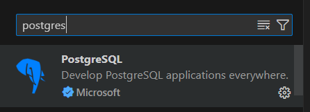

# 2.10 Configure PostgreSQL extension for VS Code

This guide walks you through setting up the PostgreSQL extension for Visual Studio Code, which provides a powerful, integrated database management experience directly within your development environment. Instead of using external applications, you'll be able to connect to, query, and manage your Azure Database for PostgreSQL Flexible Server instance seamlessly from VS Code. We'll be utilizing this to run queries and for any other database interactions.

## Installation

In our setup, this extension already gets installed when the devcontainer is being build. Nonetheless, to install it manually, search for `Postgres` in the extensions sidebar and install the one developed by Microsoft.

 

## Connecting with our Database

We'll connect the extension to the database server of our application.

1. ### Click on the PostgreSQl extension

     

2. ### Select 'add connection' option

     

3. ### Add details

    Look for the connection details from `src/.env` and add them here.

     

4. ### Connected      

    Connected to our database server.

     

### The extension is now setup and connected to our database server. We'll now use this throughout the workshop to interact with the database.