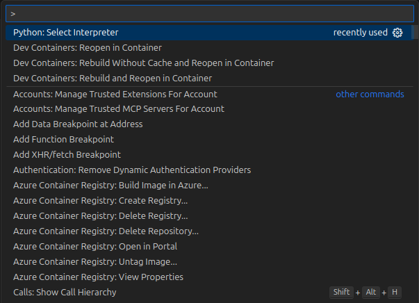

# 2.11 Run Application

## Run Database Migrations

Before starting the backend or frontend applications, you **must run the database migrations** to set up the required tables and schema. This is essential after configuring your environment variables, especially for a new deployment, as the database will be empty and the app will not function correctly without the necessary tables.

To apply the migrations, run the following command from the `backend` directory:

!!! note "**Note:** Activate your virtual environment before proceeding to avoid errors. Refer to [Section 2.4](./04-Setup-Dev-Environment.md) which contains commands to activate the virtual environment based on the specific OS and shell you are using."

!!! danger "Run database migration, creates schema and populates database with seed data."
  ```bash
  cd backend
  alembic upgrade head
  ```

This command applies all pending migrations and ensures your database schema is up to date.
!!! note "For detailed guidance on Alembic migrations, see [Section 3.2: Alembic Migrations](../03-Setting-Up-Data-in-PostgreSQL/02-Alembic-Migrations.md) of this workshop."

!!! note "**Note:** This step is required regardless of whether you use the command line or the VS Code debugger to run the applications."

### Run Apps Using VS Code Debugger

You can use the VS Code debugger to start the backend, frontend, or both at once:

1. Open the Run & Debug panel in VS Code (`Ctrl+Shift+D`).
2. Select one of the following configurations from the dropdown:
    - **Launch Backend: FastAPI** – starts the backend (also starts Arize container automatically via preLaunchTask).
    - **Launch Frontend (UI)** – starts the frontend app.
    - **Launch Frontend and Backend** – starts both apps simultaneously.
3. Click the green play button to start the applications.


!!! info "The compound configuration **Launch Frontend and Backend** will run both apps together, each in its own debugger instance."

---

## Troubleshooting

If you encounter issues while running the application, consider the following common solutions:

- **Error Starting Backend App**

    While starting the backend app from debugger you might face this error `No module named uvicorn`. If you have completed the step of installing backend project dependencies using `poetry install`, then this error means that vscode is not pointing to correct python interpreter.

    To fix this error, open the command panel in vscode using `ctrl + shift + p` type `Python: Select Interpreter` and press enter.
    

    Choose the interpreter that is in our backend project virtual environment.
    

- **Database Migration Errors:**  
  Ensure your database service is running and accessible. Double-check your environment variables for correct database connection details. Rerun the migration command if necessary.

- **Port Conflicts:**  
  Make sure ports `8000` (backend), `5173` (frontend), and `6006` (Arize Phoenix) are not in use by other applications. Stop any conflicting services or change the port numbers in your configuration.
