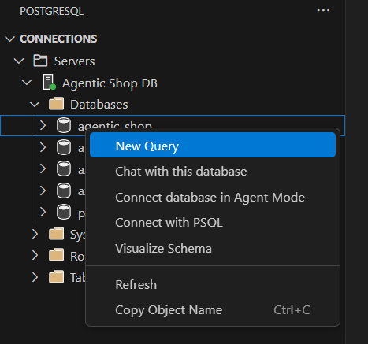
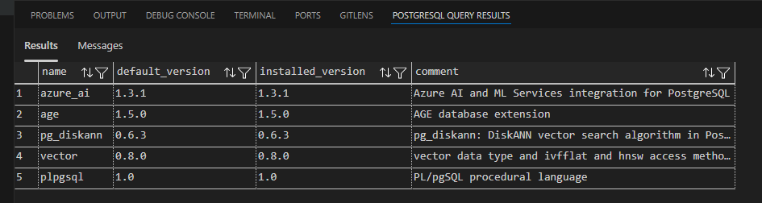

# 3.1 Install Extensions

Azure Database for PostgreSQL Flexible Server allows you to extend the functionality of your database using extensions. Extensions bundle multiple related SQL objects into a single package that can be loaded or removed from your database with a single command. After being loaded into the database, extensions function like built-in features.

!!! info "✅ These steps have **already been executed** automatically via our [Bicep infrastructure deployment](https://github.com/Azure-Samples/postgres-agentic-shop/blob/main/scripts/create-extension.sql) as part of the provisioning process. The content below is included for reference and understanding of what was configured behind the scenes."

---

## Allowlist the Extensions

To enable extensions in Azure Database for PostgreSQL Flexible Server, they must first be added to the server's _allowlist_. 


!!! note "You can also review how this is done manually in [the official documentation](https://learn.microsoft.com/azure/postgresql/extensions/how-to-allow-extensions). The documentation includes steps for allowlisting the extensions, follow the instructions provided in the link."

=== "Azure CLI"

    ```bash
    az postgres flexible-server parameter set \
      --resource-group [YOUR_RESOURCE_GROUP] \
      --server-name [YOUR_POSTGRESQL_SERVER] \
      --subscription [YOUR_SUBSCRIPTION_ID] \
      --name azure.extensions \
      --value azure_ai,pg_diskann,vector,age
    ```

!!! info "This step is handled automatically by Bicep during deployment."

---

## Install Extensions

Once allowlisted, extensions are installed in your database. This is also fully automated by the deployment process using Alembic migrations and Bicep scripts.

!!! tip "You may optionally inspect or manually install them using SQL"

=== "Azure AI extension"

    ```sql
    CREATE EXTENSION IF NOT EXISTS azure_ai;
    ```

    Enables AI-powered capabilities by connecting your database with Azure OpenAI and Cognitive Services for operations like sentiment analysis, embedding generation, and text extraction.

=== "pgvector extension"

    ```sql
    CREATE EXTENSION IF NOT EXISTS vector;
    ```

    Adds support for storing and querying vector embeddings—used to enable semantic search and similarity ranking.

=== "DiskANN extension"

    ```sql
    CREATE EXTENSION IF NOT EXISTS pg_diskann;
    ```

    Supports fast and scalable approximate nearest neighbor (ANN) search, optimized for large vector datasets.

=== "Apache AGE extension"

    ```sql
    CREATE EXTENSION IF NOT EXISTS age;
    ```

    Enables graph database capabilities within PostgreSQL using Apache AGE. Allows you to model relationships and run Cypher queries for graph traversal and reasoning.

!!! info "DiskANN depends on pgvector"

Make sure the `vector` extension is created before or use `CASCADE` to automatically handle dependencies.

---

## Verify Installed Extensions

To verify which extensions are currently installed:

1. Click on **Postgres** extension.
2. Go to **Agentic Shop DB > Databases > agentic_shop > Schemas > public > Extensions**. You can see the list of installed extensions.
3. Alternatively, go to **Agentic Shop DB > Databases**, right click on **agentic_shop** and select **New Query**. 

    

Paste the following and run it. You will see the list of extensions installed:

```sql
SELECT * FROM pg_available_extensions WHERE installed_version IS NOT NULL;
```

It will show the following output, listing all the extensions currently installed in your PostgreSQL instance.

   
---

!!! note "If you're interested in understanding how these are configured programmatically, you can explore the [Bicep deployment scripts](https://github.com/Azure-Samples/postgres-agentic-shop/blob/main/azd-hooks/). Refer to the post provision azd hook for understanding."