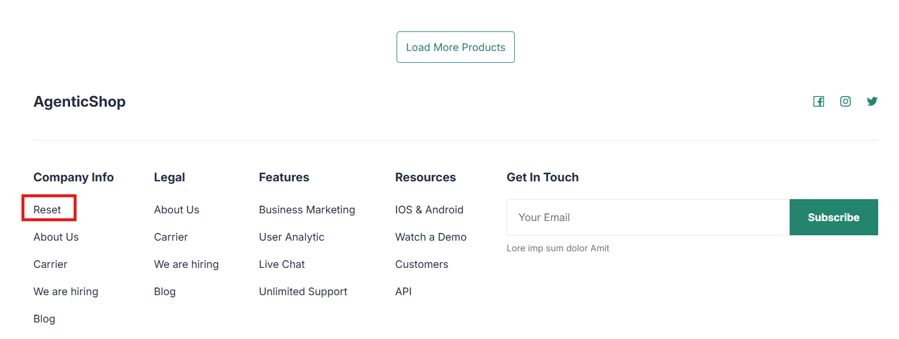

# 3.7: Reset Database

The Reset button present on the frontend products page allows users to restore the database to its original post-setup state—i.e., immediately after the application is initialized and migrations are run.
It triggers the reset service present at 'backend/src/services/reset.py'. This feature is helpful when you want to demonstrate a specific application flow again. It clears the database entries created during the initial run, allowing the flow to start fresh as if it’s being triggered for the first time.

This reset operation clears all personalized data generated during application usage:

- **personalized_product_sections** table: Stores personalized UI content for each user/product combination. When a user revisits a product, this table is checked first. If personalization exists, it is reused; otherwise, a new personalization flow is triggered. The reset service clears all entries from this table.
- **mem0_chatstore** table: Holds user preferences. Initially, it contains predefined preferences added during migrations for all user profiles (Alex, Eugene, Paul). As users interact with the app, additional preferences are stored in this table. The reset service removes preferences added during runtime and restores only the original ones.

This feature ensures a clean testing or demo environment by removing accumulated state while preserving the baseline data defined during setup.

