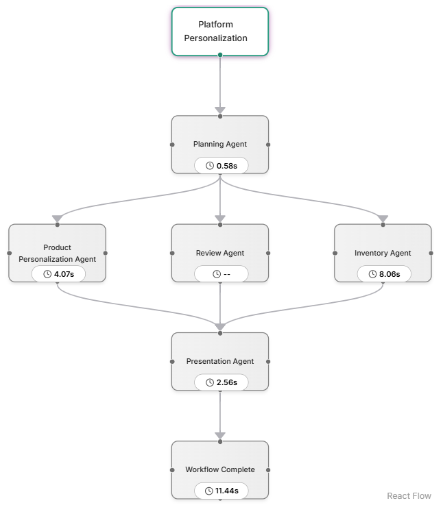

# 4.3. AgenticShop Flow Walkthrough

In this section, you'll walk through a real user interaction scenario powered by our multi-agent architecture. This flow highlights how a user query triggers intelligent agentic behavior involving vector search, planning, personalization, and inventory checking.

## 1. Open the App
Open the URL [http://localhost:5173/](http://localhost:5173/) to access the web interface. You’ll be greeted with the homepage of the **AgenticShop** frontend.

## 2. Select a Profile
You’ll see three predefined user profiles on the landing screen. Each profile is configured with different preferences.


Select any user profile. You will be taken to the **product listing page**, where a set of products are displayed.

## 3. Search for "Wireless headphones"
In the search bar, enter a query like:

```
Wireless headphones
```


Behind the scenes a vector search is performed using pg_diskann to fetch the most relevant products. We will explore more on the query routing in the following section.

## 4. Background Personalization
Each returned product triggers a **background multi-agent workflow** that personalizes the product description based on the selected user’s profile.

This proactive triggering improves UX by hiding the latency of the multi-agent system.

## 5. Open a Product Detail Page
Click on the first product to open its detail page. You’ll now see a section titled **"Your Personalized Section"**.


This personalized content is generated based on the profile selected earlier.

## 6. Review the Agentic Flow
Open the **Agentic Flow** panel again.

You’ll see:
- **Planning Agent**: Determines which agents to invoke
- **Inventory Agent**: Checks if the product is in stock
- **Product Personalization Agent**: Tailors the content
- **Presentation Agent**: Synthesizes final response



Click through each tab to review the **input** and **output** of each agent involved in the workflow.

In a later section, we will be adding another agent to the mix that specialized in product reviews.

## 7. Trigger Personalization and Memory Update

Now let’s walk through how **user preferences** are updated and **persisted using memory**, making future responses more tailored and consistent.

In the input box on the product detail page, type the following query:

```
Always show if red color is available in stock
```

This query performs two key actions in the backend:

1. **Personalization Update**:  
   It triggers the multi-agent personalization workflow again, but this time the personalization is adapted to explicitly include whether the red color variant is available. The following image shows that Red color is not available for this product as part of the Inventory Agents output.


2. **Memory Storage via mem0**:  
   The system uses **mem0** to store this preference as part of your user profile. This means that for any future product interactions, the agent will automatically consider your preference for the red color—without requiring you to re-enter it.

You can inspect this memory update by opening the Agentic Flow panel and checking the Planning Agent tab.


In the next section, we’ll extend this capability by introducing an agent that reasons over product reviews—making your experience even richer.
