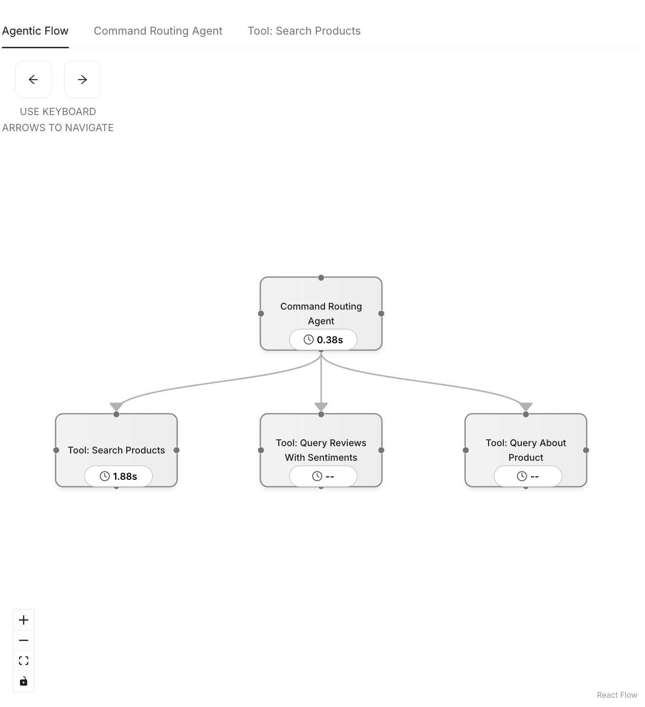

# 4.4 Tool-Enabled Agent: Intelligent Query Router

In this section, we explore a powerful enhancement to our multi-agent setup—introducing the Command Routing Agent, an agent equipped with multiple tools. Unlike earlier agents that perform a single role, this one unifies multiple capabilities under a single interface, allowing it to dynamically respond to different types of user queries.

Where previous agents handled focused tasks like personalization or inventory lookup, this agent handles broader input and delegates work to appropriate tools (including triggering the workflow we discussed in previous section).

---

### Query Routing Tools

The **Command Routing Agent** is initialized with three tools:

| Tool Name                   | Purpose                                                                 |
|----------------------------|-------------------------------------------------------------------------|
| `query_about_product`      | Triggers the multi-agent personalization workflow for the current user |
| `search_products`          | Performs a vector search over product embeddings                       |
| `query_reviews_with_sentiment` | Combines sentiment and feature filters to search reviews graphically     |

These tools are defined as callable Python functions and wrapped into LlamaIndex `FunctionTool` objects. The agent then uses the LLM to choose the correct tool based on user intent.

```python
FunctionAgent(
    name="user_query_agent",
    description="Smart router that interprets user queries and directs them to the most appropriate tool.",
    system_prompt=USER_QUERY_AGENT_PROMPT,
    tools=[...],  # Three tool functions
    llm=llm,
    verbose=settings.VERBOSE,
)
```

---

### How It Works

When a query reaches this agent, here’s the high-level flow:

1. **LLM Reasoning**: The LLM receives the user query and system prompt. Based on the tool metadata, it selects the most relevant tool to invoke.
2. **Tool Invocation**: The corresponding Python function is executed:
   - For **sentiment-based queries**, it performs a vector + graph query.
   - For **general product searches**, it uses embedding search.
   - For **personalization flows**, it dispatches a background multi-agent workflow.
3. **Streaming Response**: Each tool emits events back to the frontend via a message queue for real-time updates.

!!! note "This setup demonstrates how a single LLM-powered agent can identify user intent in real time and route the query to the most appropriate tool, enabling more natural interactions and unlocking dynamic, intent-driven experiences."

---

### Smart Query Routing in Action

Let’s walk through how the **Command Routing Agent** intelligently routes different types of user inputs to the right tool.

Each of the following steps can be tried directly in the product listing or detail page.

---

#### 1. Search for a Product Category

In the product listing page, enter a query like:

```
Waterproof headphones
```

The **Command Routing Agent** will receive this query and determine that the best tool is `search_products`.

This performs a **vector search** over the product embeddings using `pg_diskann`. To see which tool has been triggered, open the Agentic Flow panel. 



---

#### 2. Ask for Sentiment-Based Feedback

Now either from the listing page, or the product detail page try the following query:

```
wireless headphones with good noise cancellation
```

This time, the agent identifies that your query is about **review sentiment** about a particular product feature and triggers the `query_reviews_with_sentiment` tool. The product which has the most positive reviews about the requested feature is gets listed on the top. These reviews can be viewed on each product page. 

This combines the power of different Postgres extensions to perform **semantic search** (via pg_diskann), **feature extractions** (using azure_ai), and **graph queries** (using age) to return results.

---

#### 3. Trigger a Multi-Agent Workflow

Lastly the third tool that the Command Routing Agents supports is `query_about_product`. To trigger this, click on a product to open its detail page. Then, enter a query like:

```
Always show if red color is available in stock
```

The agent now routes the query to the `query_about_product` tool, which kicks off the **multi-agent personalization workflow**.

This flow involves the planning, inventory, personalization, and presentation agents, just like the earlier walkthrough.

---

These examples demonstrate how the **Command Routing Agent** interprets natural language, identifies intent, and delegates the task to the appropriate specialized tool—enhancing flexibility and user experience without requiring separate agents for each task.
