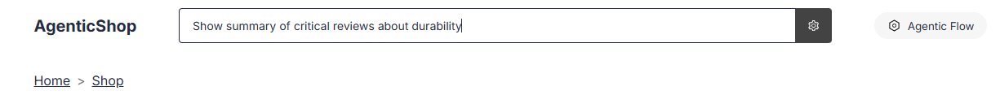
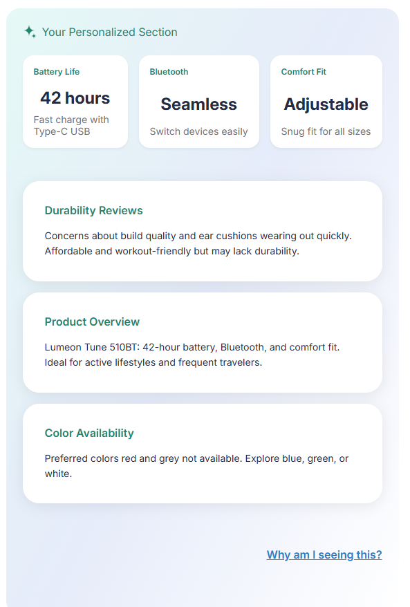
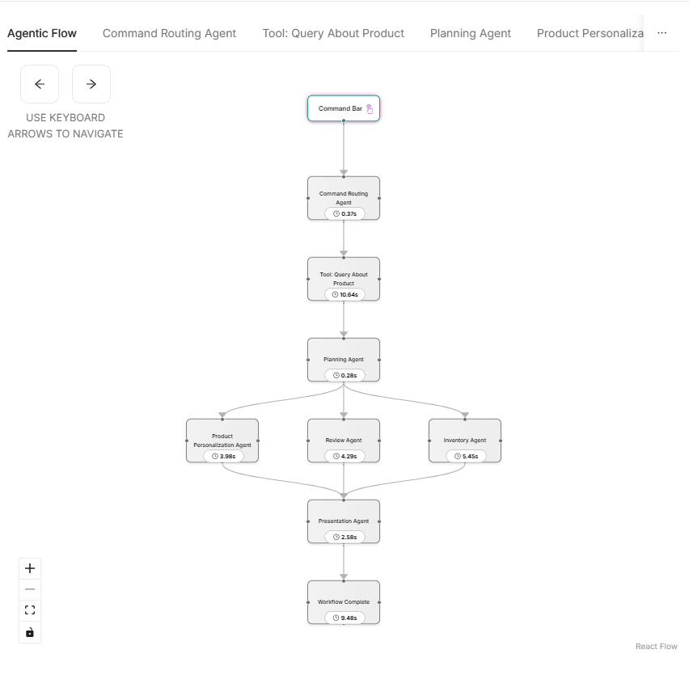

# 5.7 Running the Multi-Agent Workflow

Welcome to the final and most exciting part of this module! In this section, you'll put everything you've built to the test by running the complete multi-agent workflow—including your newly integrated Reviews Agent. The goal is to see your agent in action, verify that it is triggered as expected, and observe how it contributes to the overall system response.

Here's what you'll do:

1. **Trigger the Workflow:** You'll enter a natural language query designed to activate the Reviews Agent, specifically asking for a summary of critical reviews about durability.
2. **Observe the Output:** After the workflow processes your request, you'll check the personalized section to see if the Reviews Agent's summary appears as part of the response.
3. **Debug and Visualize:** You'll use the workflow debug flow diagram in the side panel to confirm that the Reviews Agent was indeed triggered and executed as part of the workflow.

By following these steps, you'll gain hands-on experience in:
- Validating agent orchestration in a real workflow
- Understanding how user queries map to agent actions
- Using visual tools to debug and confirm agent execution

Let's get started and see your Reviews Agent in action!

---

To trigger the Reviews Agent, enter the following command in the search bar:

```text
Show summary of critical reviews about durability
```



---

After the processing completes, you should see the summary of reviews in the personalized section, similar to the example below:



---

To further confirm that the Reviews Agent was executed, check the workflow debug flow diagram in the side panel. You should see the Reviews Agent as part of the flow, indicating it was triggered and contributed to the response:



---

Congratulations! 🎉 You've successfully run and verified your multi-agent workflow with the Reviews Agent. This is a crucial skill for building, testing, and debugging intelligent agent systems in real-world applications.