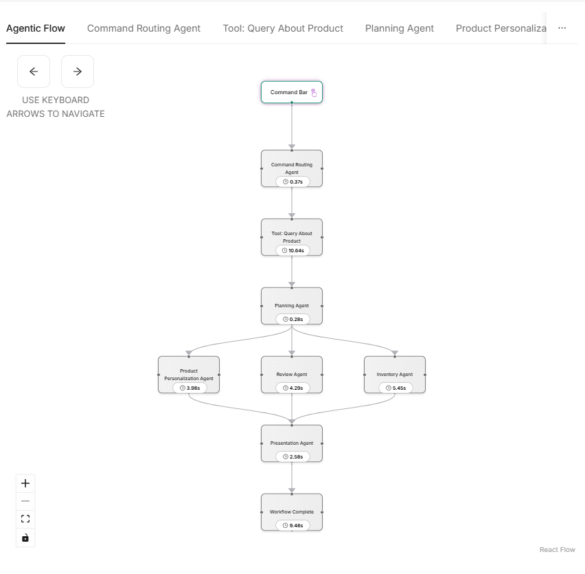

# 5.8 Multi-Agent Workflow Execution Overview

This section provides an overview of how the multi-agent workflow operates with the integrated Reviews Agent. Here, you'll see how the system responds to user queries, how the Reviews Agent is triggered, and how its output is incorporated into the overall response.

---

## Triggering the Workflow

When a user enters a natural language query such as:

```text
Show summary of critical reviews about durability
```

the workflow processes the request and activates the Reviews Agent to generate a summary of relevant product reviews.


---

## Output and Visualization

After processing, the summary generated by the Reviews Agent appears in the personalized section of the product page:


You can also confirm the execution of the Reviews Agent by viewing the workflow debug flow diagram in the side panel. The diagram will show the Reviews Agent as part of the flow, indicating it was triggered and contributed to the response:



---

Congratulations! 🎉 You've successfully run and verified the multi-agent workflow with the Reviews Agent. This is a crucial skill for building, testing, and debugging intelligent agent systems in real-world applications
