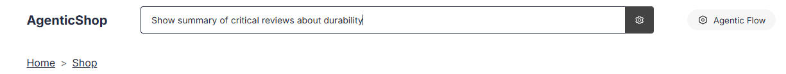

# 5.8 Running the Multi-Agent Workflow


This section explores the complete multi-agent workflow, including the newly integrated Reviews Agent. Notice how the workflow operates, how the Reviews Agent is triggered, and how it contributes to the overall system response.


Consider the following aspects as you review the workflow in action:

- How agent orchestration is validated in a real workflow
- How user queries map to agent actions
- How visual tools can be used to debug and confirm agent execution

---


To observe the Reviews Agent in action, consider entering a natural language query in the search bar that is designed to activate the Reviews Agent, such as:

```text
Show summary of critical reviews about durability
```



---


After processing, observe the summary of reviews in the personalized section, similar to the example below:


---


To further confirm that the Reviews Agent was executed, review the workflow debug flow diagram in the side panel. Notice how the Reviews Agent appears as part of the flow, indicating it was triggered and contributed to the response:


---


By reviewing this workflow, you gain insight into building, testing, and debugging intelligent agent systems in real-world applications.
