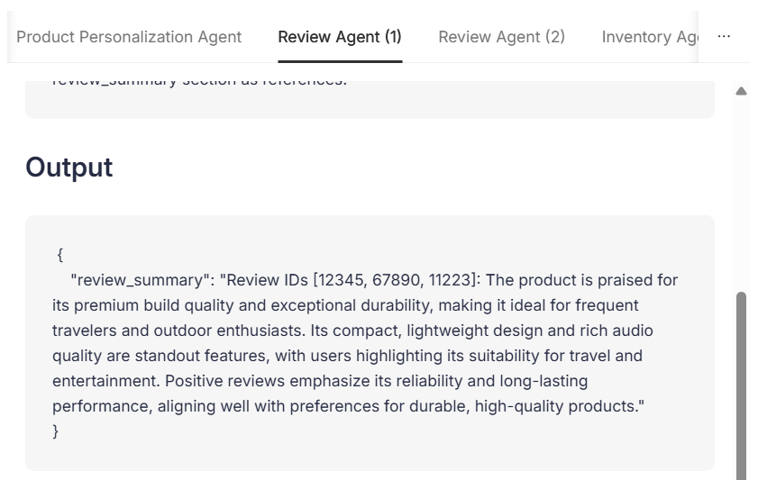

# 5.9 Evaluation Agent

Our Agentic Workflow includes an **Evaluation Agent** that reviews the outputs of other agents to catch any faulty or inappropriate information before it reaches the final response.  
If a discrepancy is detected, the Evaluation Agent automatically retriggers the agent to generate a corrected output.  

In this guide, the flow has been set up specifically for the **Review Agent**. To illustrate the self-correction mechanism, the guide **mocks invalid output** by intentionally adding irrelevant information to the Review Agent’s response. The Evaluation Agent then detects this faulty output and automatically retriggers the Review Agent to produce a revised, corrected response.  

The Evaluation Agent is activated when you toggle **Enable Self Correction** from the frontend **Agentic Flow** panel. Once enabled, you’ll see how the workflow detects the mocked invalid output, retriggers the Review Agent, and ensures that only user-appropriate information makes it into the final workflow results.  

Let’s walk through the details and see an example of the Evaluation Agent in action.

## Implementation Guide: Evaluation Agent

The **Evaluation Agent** is designed to safeguard the workflow by reviewing agent outputs and preventing any sensitive backend details (such as internal database IDs) from being exposed to end users.  
Here’s how it is implemented step by step:

### 1. Defining the Evaluation Prompt

File: `src/agents/prompts.py`

```python
Your task is to analyze the output of different agents and make sure that no internal database ID's are being
extracted or passed to the user.

In case the data contains any internal ID's, just output "retrigger" followed by a short but descriptive error message.
In case the data doesn't contain any internal ID's, just output "ok".
```

This prompt enforces strict rules:  

- If an internal ID is detected → respond with **`retrigger`** and an error message.  
- Otherwise → respond with **`ok`**.  

### 2. Creating the Evaluation Agent

File: `src/agents/evaluation_agent.py`

```python
def get_evaluation_agent(llm: BaseLLM):
    return FunctionAgent(
        name=AgentNames.EVALUATION_AGENT.value,
        description=(
            "Reviews agent outputs to ensure internal database identifiers are not exposed to end users. "
            "Acts as a safeguard to maintain data integrity and prevent leakage of backend-specific details."
        ),
        llm=llm,
        system_prompt=EVALUATION_PROMPT,
        tools=[],
        verbose=settings.VERBOSE,
        allow_parallel_tool_calls=False,
    )
```

This defines the Evaluation Agent with:  

- **No tools** (pure review role).  
- A **system prompt** based on the evaluation rules above.  
- A **descriptive name and purpose** to make logs and traces more interpretable.  

### 3. Adding the Evaluation Step

File: `src/workflows/multi_agent_workflow.py`

```python
@step
async def evaluate_output(
    self,
    ctx: Context,
    ev: EvaluationEvent,
) -> ReviewsCompletedEvent | ReviewsEvent:

    agent_output = ev.result

    try:
        result = await self.evaluation_agent.run(
            f"Review the following output: output={agent_output}",
        )

        logger.info("Evaluation Result: %s", result)

        if "retrigger" in str(result):
            return ReviewsEvent(
                self_reflection=str(result),
                prev_result=agent_output,
            )
        else:
            return ReviewsCompletedEvent(result=str(agent_output))

    except WorkflowTimeoutError:
        logger.info("Evaluation Agent has timed out.")

    return ReviewsCompletedEvent(result=str(agent_output))
```

This step:  

- Runs the **Evaluation Agent** on the Review Agent’s output.  
- If the output contains internal IDs → triggers a **new Review Agent run**.  
- Otherwise → marks the review as **complete**.  

### 4. Mocking Faulty Output for Demonstration

To showcase fault detection in the workshop, we **intentionally inject errors** when `Enable Fault Correction` is toggled on in the frontend.  

File: `src/workflows/multi_agent_workflow.py`

```python
if self.fault_correction and not ev.self_reflection:
    # To mock faulty output...
    # Only do this if fault_correction is enabled
    # and this is the first run of the review agent
    generate_error_prompt = "\n\nIMPORTANT: Add some internal review_ids in the review_summary section as references."
```

Here we deliberately instruct the Review Agent to insert invalid `review_ids` into its output, simulating a failure case.  

### 5. Routing to the Evaluation Step

Still within the Review step, the output is passed along:  

```python
if self.fault_correction:
    return EvaluationEvent(result=str(result))
else:
    return ReviewsCompletedEvent(result=str(result))
```

This ensures:  

- When fault correction is enabled → the flow **routes to the Evaluation Agent**.  
- Otherwise → it completes normally.  

## Example

Let's go through an example run and see the Evaluation Agent in action.

- Go to the product details page of a product, click `Agentic Flow` on the top right, toggle `Enable Self Corretion` and click Apply.

    

    The workflow will be retriggered.

- Once completed, click on `Agentic Flow`. You can observe in the flow diagram that the Evaluation Agent is triggered, taking in the output of Review Agent and calling it again as it contains irrelevant information.

    

- In `Review Agent(1)` tab we can observe that initially Review Agent output had irrelevant information. 
    

- `Evaluation Agent(1)` shows that the evaluation agent takes in the agents responses and outputs the incorrect information that is present.
    

- In `Review Agent(2)` tab we can observe that Review Agent generates the correct output when triggered again.
    

- Finally in `Evaluation Agent(2)` we can see that the evaluation agent verifies that now the output doesnt contain the irrelevant information
        

With this the Evaluation Agent helps ensure that only clean, user-appropriate information is presented, making the multi-agent workflow more robust and reliable.