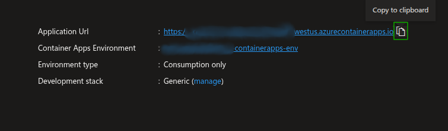
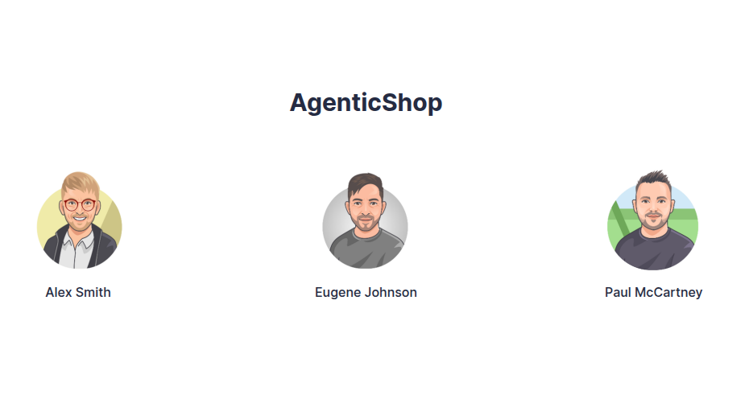

# Deploy Apps on Azure

The workshop began with a _development_ version of the _AgenticShop_ application on your own computer. Now that you have modified elements of the app and tested them out locally, you might want to _deploy_ the application on Azure. 

!!! tip "Optional deployment on Azure"

    This step is optional and is not mandatory for the functioning of this solution acceleratsor. Using this step can help you experience the app functionality when its deployed in actual production environment on Azure infrastructure.

Because you used `azd` for provisioning and deployment, this is as simple as calling `azd up` (to push all changes in both infrastructure and application). After successful deployment on Azure Container Apps, running `azd deploy` would simply rebuild and deploy the application changes only you made in this project.

!!! tip "Understand the difference between `azd up` and `azd deploy`"

    The `azd up` and `azd deploy` commands are both part of the Azure Developer CLI, but they serve different purposes:

    - `azd up` is used to package, provision, and deploy your application to Azure. It sets up the entire environment, including infrastructure and application code, from scratch. It's typically used when you're starting a new project or making significant changes to your infrastructure.

    - `azd deploy` is used to update an existing deployment. It's helpful when making iterative changes to your application without needing to re-provision the entire environment. This command is ideal for continuous development and deployment scenarios where you frequently update your application.

    In other words, use `azd up` when setting everything up from the beginning and `azd deploy` when updating an existing application deployment.

## Deploy the Updated Apps

To deploy the updated app, follow the steps below:

1. Depending on the deployment option you selected previously, open the integrated terminal in Visual Studio Code for dev container option or `sh/pwsh` terminal for local dev environment option.

2. Navigate to the root directory of your repository.

3. Execute this command to deploy your application with changes.

    !!! danger "Execute the following Azure Developer CLI command!"

    ```bash title=""
    azd up
    ```

4. When the `azd` workflow runs and select the same region and resource group that you created before. The `azd` workflow will ask you to enter the choice for the deployment of Azure Container Apps, enter `yes` to deploy updated apps on Azure Container Apps. 

    ```bash title=""
    Do you want to deploy Azure Container Apps? (y/n): yes
    ```

5. The terminal shows a link track the resources. You can click on the link to view resource creation on Azure portal. When the Azure services are deployed successfully, you shall see the following message: 

    

6. At this point, the infrastructure has been provisioned and now your updated apps will be built and deployed to Azure Container Apps. This is the build and deploy phase or azd workflow.

7. On successful completion, you will see a `SUCCESS: Your application was deployed to Azure in xx minutes xx seconds.` message on the console.

8. Once the apps are deployed on Azure, you can use the following command to just build and redeploy the apps instead of provisioning complete infrastructure.

    ```bash title=""
    azd deploy
    ```

## Test the Deployed App

1. In the Azure portal, return to the resource group containing your resources and select the **Container app** resource.


2. In the **Essentials** section of the Portal Container App's **Overview** page, select the **Application Url** to open the deployed AgenticShop app in a new browser tab.

    

3. In the _AgenticShop_ landing page, select any **User** and you can see the home page where all the products are listed!

    
    
4. You can select any product and the UI will show you the details and personalized recommendations of the products powered by AI models.


---

_You made it! That was a lot to cover - but don't worry! Now that you have a fork of the repo, you can revisit ideas at your own pace! Before you go, there are some important cleanup tasks you need to do!!_

---

!!! note "THANK YOU: Let's wrap up the session by cleaning up resources!"