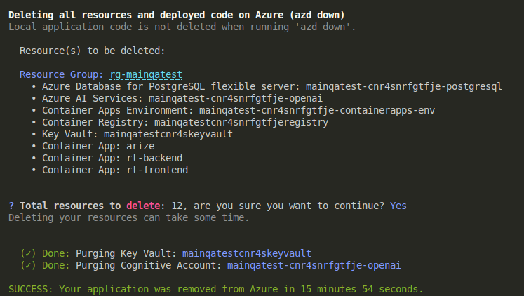

# Cleanup Resources

## Clean-up

Once you have completed this workshop, delete the Azure resources you created. You are charged for the configured capacity and resource usage. Follow these instructions to delete your resource group and all resources you created for this solution accelerator.

1. Depending on the deployment option you selected previously, open the integrated terminal in Visual Studio Code for dev container option or `sh/pwsh` terminal for local dev environment option.

2. Navigate to the root directory of your repository, execute the following command to delete the resources created by the `azd` workflow:

    !!! danger "Execute the following Azure Developer CLI command to delete resources!"

    ```bash title=""
    azd down --purge
    ```

    !!! info "The `--purge` flag purges the resources that provide soft-delete functionality in Azure, including Azure KeyVault and Azure OpenAI. This flag is required to remove all resources completely."

3. In the terminal window, you will be shown a list of the resources that will be deleted and prompted about continuing. Enter "y" at the prompt to being the resource deletion. When the tear down is completed, you shall see a `SUCCESS: Your application was removed from Azure in xx minutes xx seconds.` message at the end.

    

## Persist changes to GitHub

If you want to save any changes you have made to files, use the Source Control tool in VS Code to commit and push your changes to your fork of the GitHub repo.

## Give us a ⭐️ on GitHub

!!! question "FOUND THIS WORKSHOP AND SAMPLE USEFUL? MAKE SURE YOU GET UPDATES."

The **[Postgres Agentic Shop](https://github.com/Azure-Samples/postgres-agentic-shop)** sample is an actively updated project that will reflect the latest features and best practices for code-first development of multi-agent workflows on the Azure AI platform. **[Visit the repo](https://github.com/Azure-Samples/postgres-agentic-shop)** or click the button below, to give us a ⭐️.

<!-- Place this tag where you want the button to render. -->
<a class="github-button" href="https://github.com/Azure-Samples/postgres-agentic-shop" data-color-scheme="no-preference: light; light: light; dark: dark;" data-size="large" data-show-count="true" aria-label="Star Azure-Samples/postgres-agentic-shop on GitHub"> Give the AgenticShop Solution Accelerator a Star!</a>

## Provide Feedback

Have feedback that can help us make this lab better for others? [Open an issue](https://github.com/Azure-Samples/postgres-agentic-shop) and let us know.